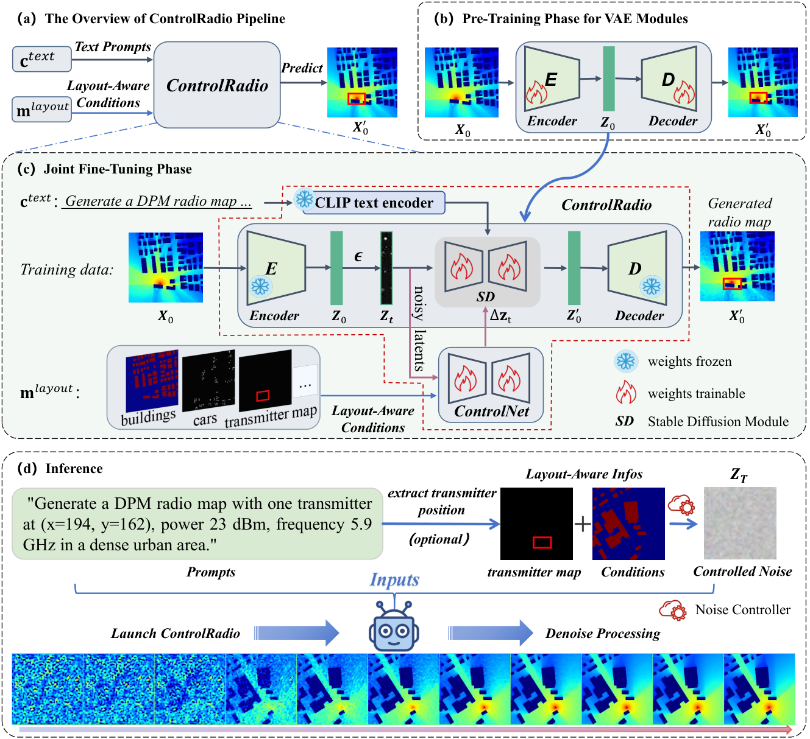
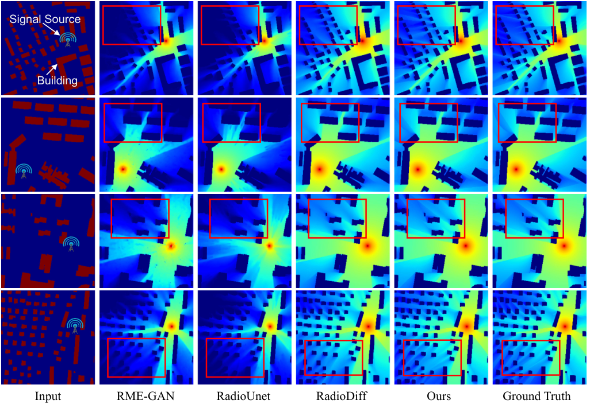

# ControlRadio

<div align="center">

## Prompt-Driven Controllable Diffusion for Cross-Modal Radio Map Generation

**Kangjun Liu | Xiying Pan | Shuhang Zhang | Xiang Xiang | Ke Chen | Yaowei Wang**

[](https://arxiv.org/abs/2608.09357)
[](https://arxiv.org/html/2608.09357v1)
[](LICENSE)

[Paper](https://arxiv.org/abs/2608.09357) | [HTML](https://arxiv.org/html/2608.09357v1) | [PDF](https://arxiv.org/pdf/2608.09357) | [RadioMapSeer](https://radiomapseer.github.io/) | Pretrained Models (coming soon)

</div>

ControlRadio is a prompt-driven controllable diffusion framework for cross-modal radio map generation. It combines natural-language descriptions with environmental layouts, such as building morphology and transmitter locations, to synthesize structurally consistent and propagation-plausible radio maps. The framework builds on Stable Diffusion and introduces a Layout-Aware ControlNet, a tunable Noise Controller, and a decoupled two-stage fine-tuning strategy.

> This repository contains the research code used for the experiments in the paper. Due to their size, trained checkpoints are not hosted on GitHub. The two pretrained models described below will be released separately on Hugging Face.

## Overview

<p align="center">
  
</p>

ControlRadio combines the following design elements:

- **Prompt-guided semantic conditioning:** a frozen OpenCLIP text encoder maps descriptions of the simulation type, transmitter, power, frequency, and environment into semantic conditions.
- **Layout-Aware ControlNet:** building morphology, transmitter masks, and optional dynamic-object cues constrain spatial generation throughout denoising.
- **Noise Controller:** inference starts from a controllable latent prior, $z_T \sim \mathcal{N}(\mu, \sigma^2 I)$, providing an explicit fidelity-stochasticity control. The paper selects $\mu=-0.1$ and $\sigma^2=0.001$ on the validation set.
- **Decoupled fine-tuning:** the radio-domain VAE is pretrained first, followed by joint adaptation of the Stable Diffusion U-Net and ControlNet while the text encoder remains frozen.

## Results

<p align="center">
  
</p>

On the RadioMapSeer benchmark, ControlRadio achieves the following results reported in the paper:

| Scenario | RMSE (lower is better) | NMSE (lower is better) | PSNR (higher is better) | SSIM (higher is better) |
|---|---:|---:|---:|---:|
| SRM (DPM without cars) | **0.0166** | **0.0024** | **35.86** | **0.9787** |
| DRM (DPM with cars) | **0.0180** | **0.0028** | **35.29** | **0.9759** |
| IRT4 (without cars) | **0.0210** | **0.0040** | **33.46** | **0.9688** |

These results measure agreement with WinProp-generated references on simulated, previously unseen layouts; they should not be interpreted as sim-to-real validation or strict electromagnetic equivalence. See the [paper](https://arxiv.org/html/2608.09357v1) for the complete comparisons, propagation-aware diagnostics, ablations, and TimeRadioMap experiments.

## Installation

The reference environment uses Python 3.8, PyTorch 1.12.1, CUDA 11.3, and PyTorch Lightning 1.5.0.

```bash
git clone https://github.com/AkonLau/ControlRadio.git
cd ControlRadio

conda env create -f environment.yaml
conda activate control
```

Alternatively, run the provided installation script:

```bash
bash install.sh
```

The SD 2.1 configuration uses the LAION OpenCLIP ViT-H/14 text encoder. On first use, `open_clip` may download its weights; for offline execution, place the corresponding Hugging Face cache under `~/.cache/huggingface/hub/`.

## Data Preparation

1. Download [RadioMapSeer](https://radiomapseer.github.io/).
2. Set the `data_root` defaults in [`controlRadio_dataset.py`](controlRadio_dataset.py) to your local dataset directory.
3. Create the JSON Lines prompt annotations expected by the selected prompt version:

```text
<RadioMapSeer root>/
|-- buildings_complete/
|-- antennas/
|-- cars/
|-- gain/
`-- prompt_v6/
    |-- prompt-DPM.json
    |-- prompt-IRT2.json
    |-- prompt-IRT4.json
    `-- prompt-Seer.json
```

Each line of a prompt file must contain relative paths and its paired description:

```json
{"source":"buildings_complete/0.png","target":"gain/DPM/0_0.png","prompt":"Generate a DPM radio map with one transmitter at (x=128, y=64), power 23 dBm, frequency 5.9 GHz in a dense urban area."}
```

The code follows the paper's map-level split: maps 0-499 for training, 500-599 for validation, and 600-700 for testing. `RadioMapSeer_RadioDiff` constructs the three-channel condition from building and antenna maps and supports optional car inputs with `--carsInput yes`.

## Model Preparation

Download a [Stable Diffusion 2.1 base](https://huggingface.co/stabilityai/stable-diffusion-2-1-base) checkpoint and convert it into an initial ControlNet checkpoint:

```bash
mkdir -p models
python tool_add_control_sd21.py \
  /path/to/v2-1_512-ema-pruned.ckpt \
  models/control_sd21_ini.ckpt
```

The conversion copies compatible Stable Diffusion weights to the trainable control branch and initializes newly introduced parameters from the model configuration. The output path must not already exist.

## Pretrained Models

We provide two trained ControlRadio checkpoints corresponding to the static and dynamic radio-map settings. Each checkpoint is approximately 13.7 GB and is therefore intentionally excluded from the GitHub repository.

The repository's `.gitignore` excludes the complete `experiments/` directory to prevent checkpoints and generated experiment files from being committed accidentally.

| Model | Setting | `--carsInput` | Checkpoint |
|---|---|---|---|
| ControlRadio-SRM | Static radio maps without cars | `no` | `epoch=99-step=337499.ckpt` |
| ControlRadio-DRM | Dynamic radio maps with cars | `yes` | `epoch=99-step=506249.ckpt` |

The Hugging Face repository will be published at:

```text
https://huggingface.co/YOUR_HF_USERNAME/ControlRadio
```

Replace `YOUR_HF_USERNAME` with the final Hugging Face account name after the upload. Download the complete `experiments/` directory from that repository and place it in the ControlRadio project root:

```text
ControlRadio/
`-- experiments/
    `-- prompt_v6/
        |-- RadioMapSeer_RadioDiff-Seer-no-carsInput/
        |   `-- control_sd21_3ch_1e-05_3_100_sd_tune_seed1230/
        |       `-- lightning_logs/version_0/checkpoints/
        |           `-- epoch=*.ckpt
        `-- RadioMapSeer_RadioDiff-Seer-carsInput/
            `-- control_sd21_3ch_1e-05_3_100_sd_tune_seed1230/
                `-- lightning_logs/version_0/checkpoints/
                    `-- epoch=99-*.ckpt
```

For example, if the Hugging Face repository preserves the directory structure above, it can be downloaded directly into the project root with the Hugging Face CLI:

```bash
pip install -U huggingface_hub
hf download YOUR_HF_USERNAME/ControlRadio --local-dir .
```

Do not rename or flatten the checkpoint directories. `controlRadio_test.py` and `controlRadio_inference.py` construct the experiment path from the command-line configuration and automatically load a `.ckpt` file from `lightning_logs/version_0/checkpoints/`. The arguments `--prompt_type`, `--simulation`, `--batch_size`, `--learning_rate`, `--max_epochs`, `--sd_locked`, `--seed`, and `--carsInput` must therefore match the downloaded model.

For both released checkpoints, use `--simulation Seer --prompt_type v6 --batch_size 3 --learning_rate 1e-5 --max_epochs 100 --sd_locked False --seed 1230`. Select the model with `--carsInput no` for ControlRadio-SRM or `--carsInput yes` for ControlRadio-DRM. Use `--test_simulation DPM`, `IRT2`, or `IRT4` to choose the evaluation target without changing the training-checkpoint directory.

## Training

Training follows two stages. The examples below show the SD 2.1 / prompt-v6 SRM workflow; adjust GPU IDs and batch sizes for your hardware.

### Stage 1: VAE pretraining

```bash
python controlRadio_train_vae.py \
  --sd_version sd21 \
  --dataset RadioMapSeer \
  --simulation DPM \
  --prompt_type v6 \
  --batch_size 6 \
  --learning_rate 1e-5 \
  --max_epochs 100 \
  --gpus 0,1,2,3,4,5,6,7 \
  --seed 1230 \
  --carsInput no
```

### Stage 2: ControlRadio fine-tuning

Replace `VAE_CKPT` with the checkpoint produced in Stage 1.

```bash
python controlRadio_train.py \
  --sd_version sd21 \
  --dataset RadioMapSeer_RadioDiff \
  --simulation DPM \
  --prompt_type v6 \
  --channel_in 3 \
  --batch_size 3 \
  --learning_rate 1e-5 \
  --max_epochs 100 \
  --sd_locked False \
  --vae_locked True \
  --gpus 0,1,2,3,4,5,6,7 \
  --seed 1230 \
  --carsInput no \
  --resume_path models/control_sd21_ini.ckpt \
  --vae_resume_path VAE_CKPT
```

The paper trains for 100 epochs with AdamW and weight decay 0.01. The provided dated shell scripts preserve the authors' full multi-stage experiment commands:

- [`20251230_train_sd21_SRM_DPM_IRT2_IRT4_251.sh`](scripts/20251230_train_sd21_SRM_DPM_IRT2_IRT4_251.sh): static DPM/IRT2/IRT4 experiments.
- [`20251230_train_sd21_DRM_DPM_251.sh`](scripts/20251230_train_sd21_DRM_DPM_251.sh): dynamic DPM experiments with cars.

## Evaluation and Inference

Checkpoints are discovered from the experiment directory assembled from the command-line options. Therefore, evaluation arguments such as prompt version, learning rate, epoch count, seed, locking mode, and car input must match the training run.

### PyTorch Lightning evaluation

```bash
python controlRadio_test.py \
  --sd_version sd21 \
  --dataset RadioMapSeer_RadioDiff \
  --simulation Seer \
  --test_simulation DPM \
  --prompt_type v6 \
  --channel_in 3 \
  --batch_size 3 \
  --test_batch_size 32 \
  --learning_rate 1e-5 \
  --max_epochs 100 \
  --sd_locked False \
  --vae_locked True \
  --gpus 0 \
  --seed 1230 \
  --carsInput no \
  --means -0.1 \
  --vars 0.001
```

### Distributed DDIM inference

```bash
CUDA_VISIBLE_DEVICES=0 python -m torch.distributed.launch \
  --nproc_per_node=1 controlRadio_inference.py \
  --sd_version sd21 \
  --dataset RadioMapSeer_RadioDiff \
  --simulation Seer \
  --test_simulation DPM \
  --prompt_type v6 \
  --channel_in 3 \
  --batch_size 3 \
  --test_batch_size 24 \
  --learning_rate 1e-5 \
  --max_epochs 100 \
  --sd_locked False \
  --vae_locked True \
  --seed 1230 \
  --carsInput no \
  --val test \
  --ddim_steps 15 \
  --means -0.1 \
  --vars 0.001 \
  --building_mask \
  --save_img
```

`controlRadio_inference.py` reports RMSE, NMSE, SSIM, PSNR, and per-map runtime. Predictions are written under the corresponding experiment's `image_log/` directory when `--save_img` is enabled. The paper uses 50 DDIM steps for the main benchmark and 15 steps for fast TimeRadioMap synthesis; validation and test errors converge at approximately 15 steps in the reported step analysis.

## Repository Structure

```text
ControlRadio/
|-- cldm/                         # Layout-aware ControlNet and DDIM implementation
|-- ldm/                          # Latent diffusion and VAE modules
|-- models/                       # SD 1.5/2.1 model configurations
|-- controlRadio_dataset.py       # Dataset loading and prompt-aware augmentation
|-- controlRadio_train_vae.py     # Stage-1 VAE pretraining
|-- controlRadio_train.py         # Stage-2 ControlRadio training
|-- controlRadio_test.py          # Lightning-based evaluation
|-- controlRadio_inference.py     # Distributed DDIM inference and metrics
|-- tool_add_control_sd21.py      # Initialize ControlNet from SD 2.1
`-- environment.yaml              # Conda environment
```

## Acknowledgements

This implementation is built upon [ControlNet](https://github.com/lllyasviel/ControlNet), [Stable Diffusion](https://github.com/CompVis/stable-diffusion), [OpenCLIP](https://github.com/mlfoundations/open_clip), and the [RadioMapSeer](https://radiomapseer.github.io/) dataset. We thank their authors for making their work publicly available.

## Citation

If you find this work useful, please cite:

```bibtex
@article{liu2026controlradio,
  title   = {ControlRadio: Prompt-Driven Controllable Diffusion for Cross-Modal Radio Map Generation},
  author  = {Liu, Kangjun and Pan, Xiying and Zhang, Shuhang and Xiang, Xiang and Chen, Ke and Wang, Yaowei},
  journal = {arXiv preprint arXiv:2608.09357},
  year    = {2026}
}
```

## License

This project is released under the [MIT License](LICENSE).
